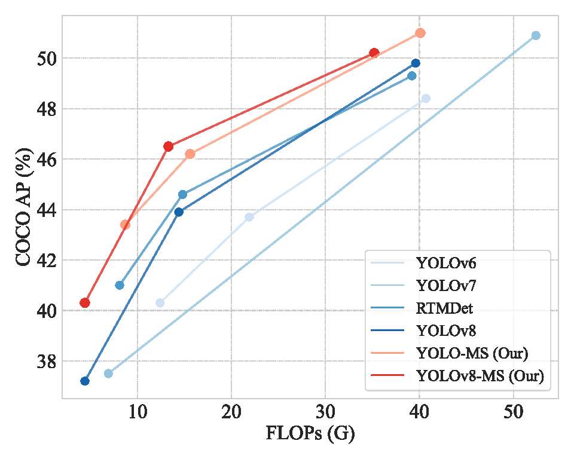
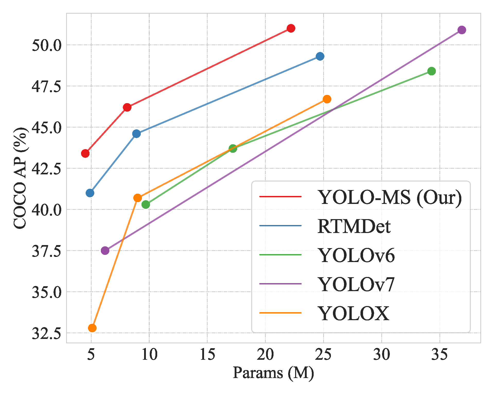

<h2> <p align=center> 🚀 YOLO-MS: Rethinking Multi-Scale Representation Learning for Real-Time Object Detection </p> </h2>

<div align="center">


[](README.md)

</div>

This repository contains the official implementation of the following paper:

> **YOLO-MS: Rethinking Multi-Scale Representation Learning for Real-Time Object Detection**<br/>
> [Yuming Chen](http://www.fishworld.site/), [Xinbin Yuan](https://github.com/yuanxinbin), [Ruiqi Wu](https://rq-wu.github.io/), [Jiabao Wang](https://mmcheng.net/wjb/), [Qibin Hou](https://houqb.github.io/), [Ming-ming Cheng](https://mmcheng.net)<br/>
> Under review

\[Homepage (TBD)\]
\[[Paper](https://arxiv.org/abs/2308.05480)\]
\[知乎 (TBD)\]
\[[AIWalker](https://mp.weixin.qq.com/s/FfG9vNM_a2k_zflWfuimsw)\]
\[Poster (TBD)\]
\[Video (TBD)\]

<table>
  <tbody>
    <tr>
        <td>
            
        </td>
        <td>
            
        </td>
    </tr>
    </tbody>
</table>

## 📄 Table of Contents

- [📄 Table of Contents](#-table-of-contents)
- [✨ News 🔝](#-news-)
- [🛠️ Dependencies and Installation 🔝](#️-dependencies-and-installation-)
- [🤖 Training and Evaluation 🔝](#-training-and-evaluation-)
- [🏡 Model Zoo 🔝](#-model-zoo-)
- [🏗️ Supported Tasks 🔝](#️-supported-tasks-)
- [📖 Citation 🔝](#-citation-)
- [📜 License 🔝](#-license-)
- [📮 Contact 🔝](#-contact-)
- [🤝 Acknowledgement 🔝](#-acknowledgement-)

## ✨ News [🔝](#-table-of-contents)

> Future work can be found in [todo.md](docs/todo.md).

- **Aug, 2023**: Our code is publicly available!

## 🛠️ Dependencies and Installation [🔝](#-table-of-contents)

> We provide a simple scrpit `install.sh` for installation, or refer to [install.md](docs/install.md) for more details.

1. Clone and enter the repo.

   ```shell
   git clone https://github.com/FishAndWasabi/YOLO-MS.git
   cd YOLO-MS
   ```

2. Run `install.sh`.

   ```shell
   bash install.sh
   ```

3. Activate your environment!

   ```shell
   conda activate YOLO-MS
   ```

## 🤖 Training and Evaluation [🔝](#-table-of-contents)

1. Training

   1.1 Single GPU

   ```shell
   python tools/train.py ${CONFIG_FILE} [optional arguments]
   ```

   1.2 Multi GPU

   ```shell
   CUDA_VISIBLE_DEVICES=x python tools/dist_train.sh ${CONFIG_FILE} ${GPU_NUM} [optional arguments]
   ```

2. Evaluation

```shell
python tools/test.py ${CONFIG_FILE} ${CHECKPOINT_FILE}
```

3. Deployment (TBD)

## 🏡 Model Zoo [🔝](#-table-of-contents)

- [ ] YOLOv5-MS
- [ ] YOLOX-MS
- [x] [YOLOv6-MS](configs/yolov6_ms)
- [ ] YOLOv7-MS
- [ ] PPYOLOE-MS
- [x] [YOLOv8-MS](configs/yolov8_ms)
- [x] [YOLO-MS (Based on RTMDet)](configs/yoloms)

<details>
<summary><b>1. YOLO-MS</b></summary>

<table>
    <thead align="center">
    <tr>
        <th> Model </th>
        <th> Resolution </th>
        <th> Epoch </th>
        <th> Params(M) </th>
        <th> FLOPs(G) </th>
        <th> $AP$ </th>
        <th> $AP_s$ </th>
        <th> $AP_m$ </th>
        <th> $AP_l$ </th>
        <th> Config </th>
        <th> 🔗  </th>
    </tr>
    </thead>
    <tbody align="center">
    <tr>
        <td style="width: 300pt"> XS </td>
        <td> 640 </td>
        <td> 300 </td>
        <td> 4.5 </td>
        <td> 8.7 </td>
        <td> 43.1 </td>
        <td> 24.0 </td>
        <td> 47.8 </td>
        <td> 59.1 </td>
        <td> [<a href="https://github.com/FishAndWasabi/YOLO-MS/tree/main/configs/yoloms/yoloms-xs_syncbn_fast_8xb8-300e_coco.py">config</a>]  </td>
        <td> [<a href="https://drive.google.com/file/d/1dCjyDfMY-tThlPb7tQXXgrpHLIWSS_Zr/view?usp=sharing">model</a>] </td>
    </tr>
    <tr>
        <td style="width: 300pt"> XS* </td>
        <td> 640 </td>
        <td> 300 </td>
        <td> 4.5 </td>
        <td> 8.7 </td>
        <td> 43.4 </td>
        <td> 23.7 </td>
        <td> 48.3 </td>
        <td> 60.3 </td>
        <td> [<a href="https://github.com/FishAndWasabi/YOLO-MS/tree/main/configs/yoloms/yoloms-xs-se_syncbn_fast_8xb8-300e_coco.py">config</a>]  </td>
        <td> [<a href="https://drive.google.com/file/d/1-GdPJX_GAfH9sXAHdRmFRTNR0kL0l5v8/view?usp=drive_link">model</a>] </td>
    </tr>
    <tr>
        <td> S </td>
        <td> 640 </td>
        <td> 300 </td>
        <td> 8.1 </td>
        <td> 15.6 </td>
        <td> 46.2 </td>
        <td> 27.5 </td>
        <td> 50.6 </td>
        <td> 62.9 </td>
        <td> [<a href="https://github.com/FishAndWasabi/YOLO-MS/tree/main/configs/yoloms/yoloms-s_syncbn_fast_8xb8-300e_coco.py">config</a>]  </td>
        <td> [<a href="https://drive.google.com/file/d/1inr-4aI9C4hOynBgmNqKyZ4-60MSoX5F/view?usp=drive_link">model</a>] </td>
    </tr>
    <tr>
        <td> S* </td>
        <td> 640 </td>
        <td> 300 </td>
        <td> 8.1 </td>
        <td> 15.6 </td>
        <td> 46.2 </td>
        <td> 26.9 </td>
        <td> 50.5 </td>
        <td> 63.0 </td>
        <td> [<a href="https://github.com/FishAndWasabi/YOLO-MS/tree/main/configs/yoloms/yoloms-s-se_syncbn_fast_8xb8-300e_coco.py">config</a>]  </td>
        <td> [<a href="https://drive.google.com/file/d/12mtXMOJDfuGdxImuPewq3-WJ0kanPjAx/view?usp=drive_link">model</a>] </td>
    </tr>
    <tr>
        <td> - </td>
        <td> 640 </td>
        <td> 300 </td>
        <td> 22.0 </td>
        <td> 40.1 </td>
        <td> 50.8 </td>
        <td> 33.2 </td>
        <td> 54.8 </td>
        <td> 66.4 </td>
        <td> [<a href="https://github.com/FishAndWasabi/YOLO-MS/tree/main/configs/yoloms/yoloms_syncbn_fast_8xb8-300e_coco.py">config</a>]  </td>
        <td> [<a href="https://drive.google.com/file/d/10JOBcIDkKDE4UpcKypnf8izSYJ_-z0P7/view?usp=drive_link">model</a>] </td>
    </tr>
    <tr>
        <td> -* </td>
        <td> 640 </td>
        <td> 300 </td>
        <td> 22.2 </td>
        <td> 40.1 </td>
        <td> 50.8 </td>
        <td> 33.2 </td>
        <td> 54.8 </td>
        <td> 66.4 </td>
        <td> [<a href="https://github.com/FishAndWasabi/YOLO-MS/tree/main/configs/yoloms/yoloms-se_syncbn_fast_8xb8-300e_coco.py">config</a>]  </td>
        <td> [<a href="https://drive.google.com/file/d/1Gf5g7Jssu88wZpPQDwNiqMIEkK4MpsdM/view?usp=drive_link">model</a>] </td>
    </tr>
    <!-- <tr>
        <td> L </td>
        <td> 640 </td>
        <td> 300 </td>
        <td colspan="8" > TBD </td>
    </tr> -->
    </tbody>
</table>

*\* refers to with SE attention*

</details>

<details>
<summary><b>2. YOLOv6</b></summary>

<table>
    <thead align="center">
    <tr>
        <th> Model </th>
        <th> Resolution </th>
        <th> Epoch </th>
        <th> Params(M) </th>
        <th> FLOPs(G) </th>
        <th> $AP$ </th>
        <th> $AP_s$ </th>
        <th> $AP_m$ </th>
        <th> $AP_l$ </th>
        <th> Config </th>
        <th> 🔗  </th>
    </tr>
    </thead>
    <tbody align="center">
    <tr>
        <td style="width: 300pt"> t </td>
        <td> 640 </td>
        <td> 400 </td>
        <td> 9.7 </td>
        <td> 12.4 </td>
        <td> 41.0 </td>
        <td> 21.2 </td>
        <td> 45.7 </td>
        <td> 57.7 </td>
        <td> [<a href="https://github.com/open-mmlab/mmyolo/blob/main/configs/yolov6/yolov6_t_syncbn_fast_8xb32-400e_coco.py">config</a>]  </td>
        <td> [<a href="https://download.openmmlab.com/mmyolo/v0/yolov6/yolov6_t_syncbn_fast_8xb32-400e_coco/yolov6_t_syncbn_fast_8xb32-400e_coco_20221030_143755-cf0d278f.pth">model</a>] </td>
    </tr>
    <tr>
        <td style="width: 300pt"> t-MS </td>
        <td> 640 </td>
        <td> 400 </td>
        <td> 8.1 </td>
        <td> 9.6 </td>
        <td> 43.5 (+2.5) </td>
        <td> 26.0 </td>
        <td> 48.3 </td>
        <td> 57.8 </td>
        <td> [<a href="https://github.com/FishAndWasabi/YOLO-MS/tree/main/configs/yolomsv6/yolov6-ms_t_syncbn_fast_8xb32-400e_coco.py">config</a>]  </td>
        <!-- <td> [<a href="">model</a>] </td> -->
        <td> [model] (TBD) </td>
    </tr>
    </tbody>
</table>

</details>

<details>
<summary><b>3. YOLOv8</b></summary>

<table>
    <thead align="center">
    <tr>
        <th> Model </th>
        <th> Resolution </th>
        <th> Epoch </th>
        <th> Params(M) </th>
        <th> FLOPs(G) </th>
        <th> $AP$ </th>
        <th> $AP_s$ </th>
        <th> $AP_m$ </th>
        <th> $AP_l$ </th>
        <th> Config </th>
        <th> 🔗  </th>
    </tr>
    </thead>
    <tbody align="center">
    <tr>
        <td style="width: 300pt"> n </td>
        <td> 640 </td>
        <td> 500 </td>
        <td> 2.9 </td>
        <td> 4.4 </td>
        <td> 37.2 </td>
        <td> 18.9 </td>
        <td> 40.5 </td>
        <td> 52.5 </td>
        <td> [<a href="https://github.com/open-mmlab/mmyolo/blob/main/configs/yolov8/yolov8_n_syncbn_fast_8xb16-500e_coco.py">config</a>]  </td>
        <td> [<a href="https://download.openmmlab.com/mmyolo/v0/yolov8/yolov8_n_syncbn_fast_8xb16-500e_coco/yolov8_n_syncbn_fast_8xb16-500e_coco_20230114_131804-88c11cdb.pth">model</a>] </td>
    </tr>
    <tr>
        <td style="width: 300pt"> n-MS </td>
        <td> 640 </td>
        <td> 500 </td>
        <td> 2.9 </td>
        <td> 4.4 </td>
        <td> 40.3 (+3.1) </td>
        <td> 22.0 </td>
        <td> 44.6 </td>
        <td> 53.7 </td>
        <td> [<a href="https://github.com/FishAndWasabi/YOLO-MS/tree/main/configs/yolomsv8/yolov8-ms_n_syncbn_fast_8xb16-500e_coco.py">config</a>]  </td>
        <td> [<a href="https://drive.google.com/file/d/1ssePhnZ4UQSRJk_NvweiQPA5llRFVlpw/view?usp=drive_link">model</a>] </td>
    </tr>
    <!-- <tr>
        <td style="width: 300pt"> s </td>
        <td> 640 </td>
        <td> 500 </td>
        <td colspan="8" > TBD </td>
    </tr>
    <tr>
        <td style="width: 300pt"> m </td>
        <td> 640 </td>
        <td> 500 </td>
        <td colspan="8" > TBD </td>
    </tr>
    <tr>
        <td style="width: 300pt"> l </td>
        <td> 640 </td>
        <td> 500 </td>
        <td colspan="8" > TBD </td>
    </tr>
    <tr>
        <td style="width: 300pt"> x </td>
        <td> 640 </td>
        <td> 500 </td>
        <td colspan="8" > TBD </td>
    </tr> -->
    </tbody>
</table>

</details>

## 🏗️ Supported Tasks [🔝](#-table-of-contents)

- [x] Object Detection
- [ ] Instance Segmentation (TBD)
- [ ] Rotated Object Detection (TBD)
- [ ] Object Tracking (TBD)
- [ ] Detection in Crowded Scene (TBD)
- [ ] Small Object Detection (TBD)

## 📖 Citation [🔝](#-table-of-contents)

If you find our repo useful for your research, please cite us:

```
@misc{chen2023yoloms,
      title={YOLO-MS: Rethinking Multi-Scale Representation Learning for Real-time Object Detection},
      author={Yuming Chen and Xinbin Yuan and Ruiqi Wu and Jiabao Wang and Qibin Hou and Ming-Ming Cheng},
      year={2023},
      eprint={2308.05480},
      archivePrefix={arXiv},
      primaryClass={cs.CV}
}
```

This project is based on the open source codebase [MMYOLO](https://github.com/open-mmlab/mmyolo).

```
@misc{mmyolo2022,
    title={{MMYOLO: OpenMMLab YOLO} series toolbox and benchmark},
    author={MMYOLO Contributors},
    howpublished = {\url{https://github.com/open-mmlab/mmyolo}},
    year={2022}
}
```

## 📜 License [🔝](#-table-of-contents)

Licensed under a [Creative Commons Attribution-NonCommercial 4.0 International](https://creativecommons.org/licenses/by-nc/4.0/) for Non-commercial use only. Any commercial use should get formal permission first.

## 📮 Contact [🔝](#-table-of-contents)

For technical questions, please contact `chenyuming[AT]mail.nankai.edu.cn`.
For commercial licensing, please contact `cmm[AT]nankai.edu.cn` and `andrewhoux[AT]gmail.com`.

## 🤝 Acknowledgement [🔝](#-table-of-contents)

This repo is modified from open source real-time object detection codebase [MMYOLO](https://github.com/open-mmlab/mmyolo).
The README file is referred to [LED](https://github.com/Srameo/LED) and [CrossKD](https://github.com/jbwang1997/CrossKD)
